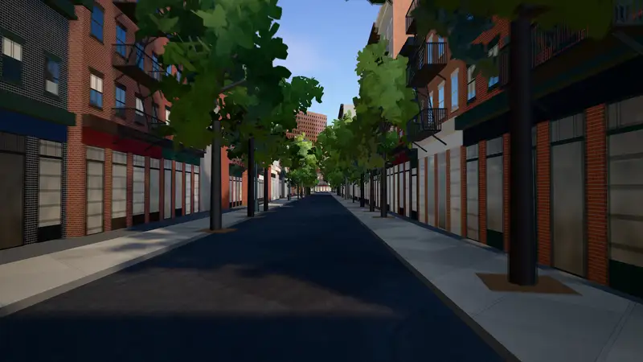
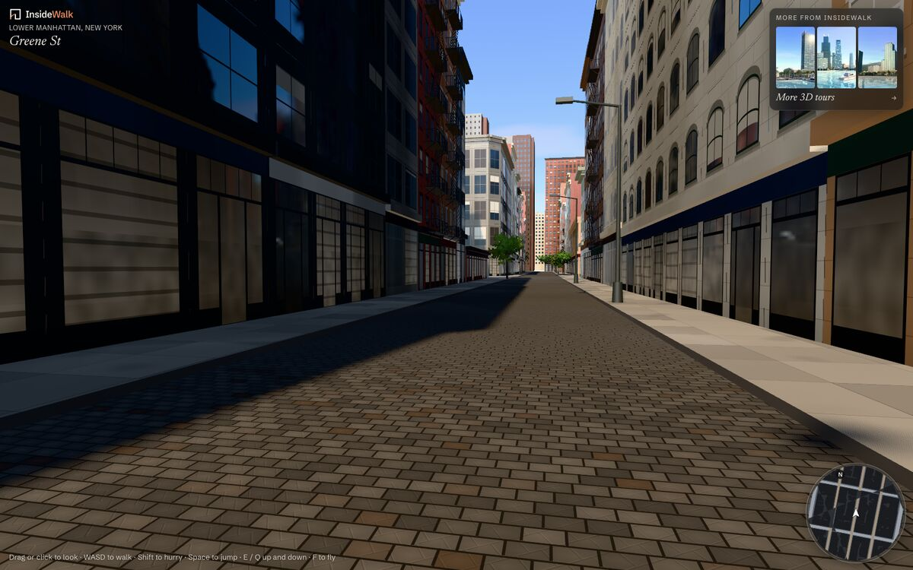
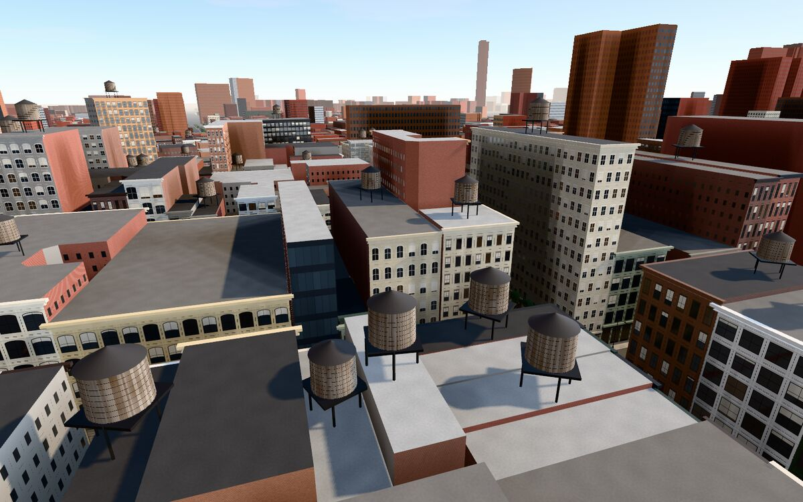

<div align="center">

<a href="https://github.com/itsnex1s/insidewalk-newyork/releases/download/film-v1/lower-manhattan-1080p.mp4"></a>

# Lower Manhattan in 3D

**Walk the streets of Lower Manhattan in your browser, from 14th Street down to the Battery.**<br />
Every building, sidewalk, roadbed and street tree comes from New York City's open data, and the city streams in around you as you walk.

[**▶ Walk it now: newyork.insidewalk.app**](https://newyork.insidewalk.app) &nbsp;·&nbsp; [**Watch the film**](https://github.com/itsnex1s/insidewalk-newyork/releases/download/film-v1/lower-manhattan-1080p.mp4) <sub>(1080p, 35 s · [4K](https://github.com/itsnex1s/insidewalk-newyork/releases/download/film-v1/lower-manhattan.mp4))</sub>

[](https://newyork.insidewalk.app)
[](LICENSE)
[](https://threejs.org)
[](https://www.typescriptlang.org)
[](https://vite.dev)

</div>

---

<table>
  <tr>
    <td width="50%"></td>
    <td width="50%"></td>
  </tr>
  <tr>
    <td align="center"><sub>Greene Street at eye level, with the minimap in the corner</sub></td>
    <td align="center"><sub>Flying over the water tanks of SoHo</sub></td>
  </tr>
</table>

## What it is

A walkable 3D model of Manhattan below 14th Street, built entirely from public data and rendered with three.js on WebGPU. You can:

- **Walk** at eye level, step up onto the kerbs, slide along the walls and jump.
- **Run** with Shift, or **fly** over the rooftops and land anywhere.
- Find your way with a **minimap** in the corner, styled after driving games, and a label naming the street you are on.
- Watch the **reflections**: the city shows in the glass of the towers around you.
- Change the **time of day**: the afternoon, the golden hour with the sun setting straight down the cross streets, or the night, when the windows light one by one and the street lights come on.

There are no hand-made models. Facades, cornices, fire escapes, storefronts, water tanks, street lights and trees are all generated from each building's footprint, height, age and land-use class.

## Controls

| | Keyboard and mouse | Touch |
|---|---|---|
| Look | Drag, or click to lock the mouse | Drag with the right thumb |
| Walk | <kbd>W</kbd> <kbd>A</kbd> <kbd>S</kbd> <kbd>D</kbd> or the arrow keys | Stick under the left thumb, wherever it lands |
| Hurry | Hold <kbd>Shift</kbd> | Push the stick past its rim |
| Jump | <kbd>Space</kbd> | **Jump** button |
| Up / down | <kbd>E</kbd> / <kbd>Q</kbd> (or <kbd>PgUp</kbd> / <kbd>PgDn</kbd>) | Hold **Up** / **Down** while flying |
| Fly or land | <kbd>F</kbd> | **Fly** / **Land** button |
| Time of day | <kbd>T</kbd>, or the Day / Sunset / Night switch | The switch under the street's name |

On a touch-only phone or tablet the controls work like a mobile game: a floating stick on the left, look on the right and buttons by the right thumb.

You can link to a particular spot with `?at=x,z,bearing[,pitch,height]`. The values are metres from Prince and Greene (x east, z south) and degrees, for example [`?at=0,200,200,-12,260`](https://newyork.insidewalk.app/?at=0,200,200,-12,260). Add `&time=sunset` or `&time=night` (or an hour from 16.5 to 22, such as `&time=20.6` for the blue hour) to open at that time, for example [Prince Street at sunset](https://newyork.insidewalk.app/?at=100,-51,303,3&time=sunset).

## How it works

```
NYC Open Data + OpenStreetMap ──► scripts/fetch-city.mjs ──► public/data/city/t_<i>_<j>.json  (250 m tiles)
                                                                       │
                     browser ◄── tiles streamed around the camera ◄────┘
```

**Data.** `npm run data` downloads Lower Manhattan once and writes it out as 250 m tiles in local metres:

- building footprints and roof heights, joined to MapPLUTO for each building's class, year, floors and historic district;
- sidewalks and roadbeds from the planimetric database;
- living street trees from the tree census;
- street names from OpenStreetMap, which also marks the streets paved in Belgian block.

The script decides which walls face a street, so the client knows where storefronts go. It also places the street lights along every kerb.

**Streaming.** Only what you can see gets loaded, as in an open-world game.

- Tiles are built at four levels of detail (near, mid, far, towers) according to their distance and whether they are in the camera's view.
- Data is fetched ahead of time, a few files at once.
- Each tile is built in a queue that runs between frames, and shows only once its shaders are ready (`compileAsync`). Nothing new has to compile the moment it comes into view.

**Rendering.** The renderer is three.js `WebGPURenderer` with TSL node materials.

- Shadows follow the walker.
- Sky occlusion is baked into a height map, a few milliseconds per frame, so streets between towers come out darker than open plazas.
- Reflections come from a cube capture of the city, drawn one face per frame whenever you stop.
- A colour grade finishes the image.
- The time of day (`src/daytime.ts`) is a few keyed looks, from the afternoon to the night, with every hour between interpolated: the sun, the sky, the haze, the exposure and the grade. After dark the windows light up in the facade shaders, each one by a hash. The street lights don't use real lights: their pools are drawn into a 1 m texture of the ground around the walker (`src/engine/night.ts`), which the streets and walls sample.

**Performance tricks** worth stealing, all in `src/engine`:

- **Shared shaders for instanced meshes.** three.js builds a separate shader for every `InstancedMesh`. Here each one becomes a plain mesh whose geometry carries the instance matrices as instanced attributes, so every tile's trees share one shader (`shareShaders` in `util.ts`). That removed every frame over 50 ms when flying at speed.
- **Shaders built before a tile shows.** `prepare` in `look.ts` builds them in the scene pass's own render context, so the first draw finds them ready.
- **Frozen matrices.** Tile objects get `matrixAutoUpdate = false`, because nothing in a tile ever moves.

## Getting started

You need Node 22 or newer and a browser with WebGPU (Chrome or Edge 113+, Safari 26).

```bash
git clone https://github.com/itsnex1s/insidewalk-newyork.git
cd insidewalk-newyork
npm install
npm run dev          # http://localhost:5240
```

The repository already includes the processed city data, so the step below is optional. It downloads everything again from the sources (a few minutes, mostly Overpass):

```bash
npm run data
```

Other scripts:

| Command | What it does |
|---|---|
| `npm run build` | Type-checks and builds to `dist/` |
| `npm run posters` | Re-renders the loading screen still, its blurred placeholder and the social card from the walk itself (needs the dev server, `cwebp` and ImageMagick) |
| `node scripts/still.mjs "<query>" out.png` | Saves a frame from headless Chrome. `--profile <ms>` lists the costliest functions |
| `node scripts/film.mjs` | Films the shots in `scripts/film.json` frame by frame in 4K, with motion blur and crossfades, into `film/` (needs the dev server and ffmpeg). `--board` first draws a storyboard of each shot's first, middle and last frame |
| `node scripts/touch-film.mjs` | Records the touch controls as if on an iPad Pro 13", driven by scripted fingers, into `film/touch-ipad.mp4` (needs the dev server and ffmpeg). `--board` draws a frame a second first |

**Deploying.** The site is static files served by Cloudflare Workers (`wrangler.jsonc`). Any static host works, because `dist/` is all there is.

## Project layout

```
src/
  main.ts          boot, loading screen, frame loop
  walk.ts          walking, jumping, flying, collisions
  minimap.ts       the round map in the corner
  city/            tiles, buildings, facades, roofs, streets, planting
  engine/          lighting and post, reflections, sky occlusion, trees, textures
scripts/           data download, stills and posters
public/data/city/  the city, in 250 m tiles
```

## Data and credits

- **[NYC Open Data](https://opendata.cityofnewyork.us/)**: [Building Footprints](https://data.cityofnewyork.us/d/5zhs-2jue), [MapPLUTO](https://data.cityofnewyork.us/d/64uk-42ks), [Planimetric Sidewalk](https://data.cityofnewyork.us/d/52n9-sdep) and [Roadbed](https://data.cityofnewyork.us/d/i36f-5ih7), [2015 Street Tree Census](https://data.cityofnewyork.us/d/uvpi-gqnh). Used under the [NYC Open Data terms of use](https://opendata.cityofnewyork.us/overview/#termsofuse).
- **Street names and paving** © [OpenStreetMap](https://www.openstreetmap.org/copyright) contributors, available under the [Open Database License](https://opendatacommons.org/licenses/odbl/).
- **Textures** ([Aerial Asphalt 01](https://polyhaven.com/a/aerial_asphalt_01), [Concrete Pavers 02](https://polyhaven.com/a/concrete_pavers_02)) from [Poly Haven](https://polyhaven.com), CC0.
- **[three.js](https://threejs.org)** (MIT). Fonts: [Newsreader](https://fonts.google.com/specimen/Newsreader) and [Schibsted Grotesk](https://fonts.google.com/specimen/Schibsted+Grotesk) (OFL).

## More walks

This is one of the [InsideWalk](https://insidewalk.app) 3D tours. See the others, from Miami and Abu Dhabi to Batumi, at **[tours.insidewalk.app](https://tours.insidewalk.app)**.

## License

The code is released under the [MIT](LICENSE) license. The city data in `public/data` and the textures keep the licences of their sources, listed above.
